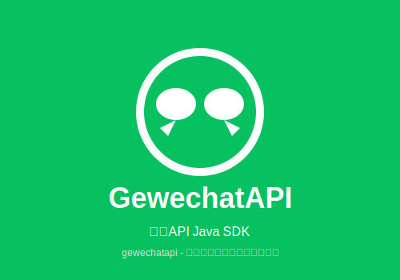

<p align="center">
  
</p>

<h1 align="center">GewechatAPI</h1>

<p align="center">
  <strong>微信API Java SDK - 简单、易用、免费开源</strong>
</p>

<p align="center">
  <a href="#联系方式">💬 有任何帮助或疑问请联系 gewechatapi</a>
</p>

***

## ⚠️ 重要免责声明（必读）

**使用本项目前，请务必仔细阅读并理解以下免责声明：**

### 1. 用途限制

- 本项目**仅供学习和技术研究使用**
- **严禁用于任何商业用途或非法行为**
- 使用者需遵守《中华人民共和国网络安全法》等相关法律法规

### 2. 风险提示

- 使用本项目**可能导致您的微信账号被永久封禁**
- 微信官方明确禁止第三方自动化工具的使用
- 本项目**与微信官方无关**，未获得微信官方任何授权或认可

### 3. 责任声明

- 本项目作者不对本工具的安全性、完整性、可靠性、有效性、正确性或适用性做任何明示或暗示的保证
- 不对因使用或滥用本工具造成的任何直接或间接损失、责任、索赔承担任何责任
- 使用者需自行承担全部法律风险和责任

### 4. 使用即同意

- 下载、安装、运行或使用本工具，即表示您已阅读并同意本免责声明
- 如有异议，请立即停止使用并删除所有相关文件

### 5. 项目变更

- 作者保留随时修改、更新、删除或终止本工具的权利，无需事先通知

***

## 📞 联系方式

**有任何帮助或疑问，请联系：gewechatapi**

<p align="center">
  
</p>

- 💬 微信：gewechatapi
- 📧 邮箱：<gewechatapi@example.com>
- 🐙 GitHub Issues：[提交问题](https://github.com/qian389826-maker/gewechatapi/issues)

***

## 🚀 项目简介

GewechatAPI 是一个开源的微信 API Java SDK，支持二次开发，提供 RESTful API 接入方式。

### 框架优势

- ✅ 简单易用，无接入难度
- ✅ 无需安装电脑微信
- ✅ 无需安装手机破解插件
- ✅ 扫码登录即可使用
- ✅ 支持多种消息类型
- ✅ 完善的文档和示例

### 主要能力

- 📨 消息自动化：发送文本、图片、文件、表情、小程序、语音等
- 🤖 自定义消息处理、自动回复、关键词回复
- 👥 群管理及好友管理
- 🤖 支持接入 AI 模型（ChatGPT 等）

***

## 📋 功能清单

- [x] **登录模块**：获取登录二维码、执行登录、设置消息回调
- [x] **联系人模块**：获取通讯录、搜索/添加/删除好友、设置备注
- [x] **群模块**：创建/修改群、邀请/删除成员、退出/解散群聊
- [x] **消息模块**：发送各类消息、转发消息、接收消息
- [x] **标签模块**：添加/删除标签、标签列表、修改好友标签
- [x] **个人模块**：获取/修改个人资料、隐私设置
- [x] **收藏夹模块**：同步/获取/删除收藏夹
- [x] **账号管理**：断线重连、退出微信、检查在线

***

## 🚀 快速开始

### 环境要求

- Java 8 或更高版本
- Maven 3.x

### 安装依赖

```xml
<dependency>
    <groupId>com.gewechat</groupId>
    <artifactId>gewechatapi</artifactId>
    <version>1.0.0</version>
</dependency>
```

### 基本用法

```java
import com.gewechat.api.base.LoginApi;
import com.gewechat.api.base.MessageApi;
import com.alibaba.fastjson2.JSONObject;

public class Demo {
    public static void main(String[] args) {
        // 1. 获取 Token
        JSONObject token = LoginApi.getToken();
        
        // 2. 获取登录二维码
        JSONObject qr = LoginApi.getQr("");
        
        // 3. 确认登录
        JSONObject loginResult = LoginApi.checkQr(appId, uuid, "");
        
        // 4. 发送消息
        MessageApi.postText(appId, "wxid_xxx", "Hello", "");
    }
}
```

***

## 📚 API 文档

### 服务地址

- **API 服务**：`http://{服务ip}:2531/v2/api/{接口名}`
- **文件下载**：`http://{服务ip}:2532/download/{文件路径}`

### 模块说明

| 模块    | 类名          | 功能       | 方法数 |
| ----- | ----------- | -------- | --- |
| 登录模块  | LoginApi    | 登录、扫码、退出 | 7   |
| 消息模块  | MessageApi  | 发送各类消息   | 16  |
| 联系人模块 | ContactApi  | 好友管理     | 9   |
| 群模块   | GroupApi    | 群聊管理     | 13  |
| 个人模块  | PersonalApi | 个人信息     | 9   |
| 标签模块  | LabelApi    | 标签管理     | 6   |
| 收藏夹模块 | FavorApi    | 收藏夹管理    | 3   |
| 下载模块  | DownloadApi | 文件下载     | 5   |

***

## 🛠️ 部署说明

### Docker 部署

```bash
# 1. 拉取镜像
docker pull registry.cn-hangzhou.aliyuncs.com/gewe/gewe:latest

# 2. 运行容器
mkdir -p /root/temp
docker run -itd -v /root/temp:/root/temp -p 2531:2531 -p 2532:2532 \
  --privileged=true --name=gewe gewe /usr/sbin/init

# 3. 设置开机启动
docker update --restart=always gewe
```

***

## ⚠️ 注意事项

1. 本项目仅供学习研究，请勿用于商业场景
2. 使用时需遵守当地法律法规
3. 建议在同省服务器部署使用
4. 微信官方可能随时更新协议导致本项目失效
5. **有任何问题请联系 gewechatapi**

***

## 🤝 贡献指南

欢迎提交 Issue 和 Pull Request！

**联系方式：gewechatapi**

<br />

<br />

<br />

***

## 📄 开源协议

本项目采用 [MIT License](LICENSE) 开源协议

***

## ⚠️ 免责声明最终确认

**再次强调：使用本项目即表示您已充分了解并接受所有风险，自行承担一切后果。作者不对任何使用行为负责。**

**需要帮助？请联系 gewechatapi**

***

<p align="center">
  <strong>仅供学习研究，使用风险自负</strong><br>
  <strong>💬 有任何帮助或疑问请联系 gewechatapi</strong>
</p>
